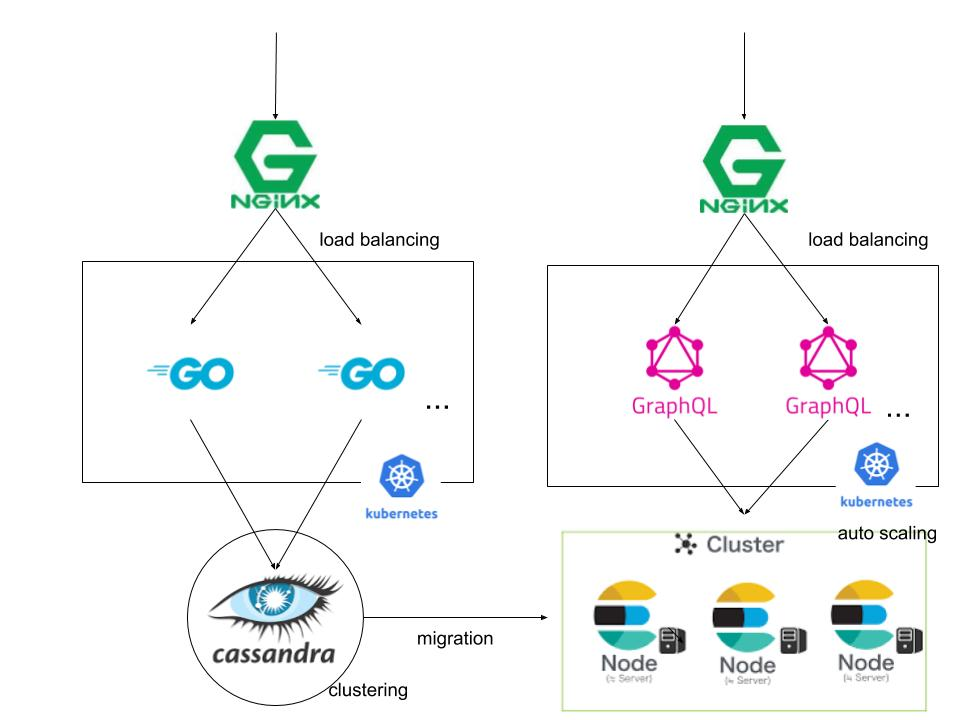

# Architecture
- 構成図
    
    
1. 大量のイベント情報の処理
    - `Nginx`を用いて、ロードバランシングを行い、負荷を軽減.
    - `Golang`でバックエンドを軽量なバックエンドを構成.
        - `kubernetes`
            - オートスケールで高負荷に対応.
            - ローリングアップデートでダウンタウンの発生を抑制.
    - DBは`cassandra`を使用.
        - NoSQLで高速なデータ登録を実行.
        - クラスタリングを行い、高負荷に耐えられる構成.
1. データ取得
    - `GraphQL`サーバを構築し、リソース取得内容を柔軟に対応.
        - サーバ構成は、イベント情報と同様.
    - DBは`ElasticSearch`を使用.
        - 全文検索エンジンにすることで、高速な検索を期待.
        - クラスタリングを行い、高負荷に耐えられる構成.
1. データ移行
    - `cassandra`から`ElasticSearch`へデータのマイグレーションを実行.
        - `Java`または`Scala`を想定.
        - pluginなどが揃えば、`Embulk`の利用なども考慮.
